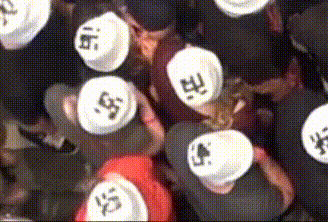

# `DL4PuDe:` A hybrid framework of deep learning and visualization for pushing behavior detection in pedestrian dynamics

[](https://zenodo.org/badge/latestdoi/447236287) [](./LICENSE)       

This repository is for the DL4PuDe framework, along with its  published [paper](https://www.mdpi.com/1424-8220/22/11/4040/htm), which is as follows.
```
Alia, Ahmed, Mohammed Maree, and Mohcine Chraibi. 2022. "A Hybrid Deep Learning and Visualization Framework for Pushing Behavior Detection in Pedestrian Dynamics" Sensors 22, no. 11: 4040. 
```
## Content
1. <a href="#aim"> Framework aim. </a>
2. <a href="#motivation"> Framework Motivation. </a>
3. <a href="#defention"> Pushing Behavior Defention. </a>
4. <a href="#architicture"> Framework Architicture. </a>
5. <a href="#install"> How to install and use the framework. </a>
6. <a href="#demo"> Demo. </a>
7. <a href="#videos"> Experiments Videos. </a>
8. <a href="#cnn"> CNN-based Classifiers </a>
    * <a href="#cnnsource"> Source code for building and training CNN-based classifiers. </a>
    * <a href="#trained"> Trained CNN-based classifiers. </a>
    * <a href="#evaluate"> Source code for evaluating the trained CNN-based classifiers. </a>
    *  <a href="#test"> Test sets. </a>
9. <a href="#list"> List of papers that cited this work. </a>

## Aim of `Dl4PuDe` Framework
<a name="aim">

`Dl4PuDe`  aims to automatically detect and annotate pushing behavior at the patch level in video recordings of human crowds. 

## Motivation of `Dl4PuDe` Framework
<a name="motivation">

To assist researchers in the field of crowd dynamics in gaining a better understanding of pushing dynamics, which is crucial for effectively managing a comfortable and safe crowd.

## Pushing Behavior Defention
<a name="defention">

In this article, pushing can be defined as a behavior that pedestrians use to reach a target faster.
xxxxxxxxx
<table border="0" width="100%" align="center">
<tr>
    <td align="center">   </td>
    <td align="center">   </td>
    <td align="center">  </td>
</tr>
</table>

## Test




## The Architecture of `DL4PuDe`
<a name="architicture">

`DL4PuDe` mainly relied on the power of EfficientNet-B0-based classifier, RAFT and wheel visualization methods.


Kindly note that we use the <a href="https://github.com/princeton-vl/RAFT" />[RAFT repository] </a> for optical flow estimation in our project.

**Example**
<table border="0" width="100%" align="center">
<tr>
   <th align="cenetr"> Input video </th>
   <th align="cenetr"> Output video * </th>
   
</tr>
<tr>
   <td align="center">  </td>
   <td align="center">  </td>
</tr>
<tr>
   <td colspan="2"> * The framework detects pushing patches every 12 frames (12/25 s), the red boxes refer to the pushing patches. </td>
</tr>
</table>

## Installation
<a name="install">

1. Clone the repository in your directory.
```
git clone https://github.com/PedestrianDynamics/PushingBehaviorDetectionFramework.git
```
2. Install the required libraries.
```
cd PushingBehaviorDetectionFramework
pip install -r libraries.txt
```
3. Run the framework. 
```
python3 run.py --video [input video path]  
               --roi ["x coordinate of left-top ROI corner" "y coordinate of left-top ROI corner"
               "x coordinate of  right-bottom ROI corner" "y coordinate of right-bottom ROI corner" ] 
               --patch [rows cols]    
               --ratio [scale of video]   
               --angle [angle in degrees for rotating the input video to make crowd flow direction
               from left to right ---> ]
```   
## Demo 
<a name="demo">

>Run the following command

```   
python3 run.py --video ./videos/150.mp4  --roi 380 128 1356 1294 --patch 3 3 --ratio 0.5  --angle 0
```  
> Then, you will see the following details.


> When the progress of the framework is complete, it will generate the annotated video in the framework directory. Please note that the "150 annotated video" is available on the directory root under the "150-demo.mp4" name.

## Experiments Videos
<a name="videos">

The original experiments videos that are used in this work are available through the [Pedestrian Dynamics Data Archive hosted](http://ped.fz-juelich.de/da/2018crowdqueue) by the Forschungszentrum Juelich. Also, the undistorted videos are available by [this link.](https://drive.google.com/drive/folders/16eZhC9mnUQUXxUeIUXd6xwBU2fSf3qCz?usp=sharing) 

## CNN-based Classifiers
<a name="cnn">

We use four CNN-based classifiers for building and evaluating our classifier, including EfficientNet-B0, MobileNet, InceptionV3, and ResNet50. The source code for building, training and evaluating the CNN-based classifiers, as well as the trained classifiers are available in the below links.
1. Source code for building and training the CNN-based classifiers. <a name="cnnsource">
   * [EfficientNet-B0-based classifier.](./CNN/CNN-Architectures/efficientNetB0.ipynb)
   * [MobileNet-based classifier.](./CNN/CNN-Architectures/InceptionV3.ipynb)
   * [InceptionV3-based classifier.](./CNN/CNN-Architectures/InceptionV3.ipynb)
   * [ResNet50-based classifier.](./CNN/CNN-Architectures/ResNet50.ipynb)
2. [Trained CNN-based classifiers.](https://drive.google.com/drive/folders/1vmgYufnt4_NNQUE9PGYZLkrn5DmErENu?usp=sharing) <a name="trained">
3. CNN-based classifiers Evaluation. <a name="#evaluate">
   * [Patch-based medium RAFT-MIM12 dataset.](./CNN/Classifiers-evaluation/patch-based-medium-RAFT-MIM12/)
   * [Patch-based medium RAFT-MIM25 dataset.](./CNN/Classifiers-evaluation/patch-based-medium-RAFT-MIM25/)
   * [Patch-based small RAFT-MIM12 dataset.](./CNN/Classifiers-evaluation/patch-based-small-RAFT-MIM12/)
   * [Patch-based small RAFT-MIM25 dataset.](./CNN/Classifiers-evaluation/patch-based-small-RAFT-MIM25/)
   * [Patch-based medium FB-MIM12 dataset.](./CNN/Classifiers-evaluation/patch-based-medium-FB-MM12/)
   * [Frame-based RAFT-MIM12 dataset.](./CNN/Classifiers-evaluation/frame-based-RAFT-MIM12/)
   * [Frame-based RAFT-MIM25 dataset.](./CNN/Classifiers-evaluation/frame-based-RAFT-MIM25/)
4. [Patch-based MIM test sets.](./CNN/Classifiers-evaluation/test-sets/) <a name="test">
5. MIM training and validation sets are available from the corresponding authors upon request.
 
## List of papers that cited this work 
<a name="list">

To access the list of papers citing this work, kindly click on this [link.](https://scholar.google.com/scholar?oi=bibs&hl=en&cites=14553227952079022657&as_sdt=5)

## Citation

If you utilize this framework or the generated dataset in your work, please cite it using the following BibTex entry:
```
Alia, Ahmed, Mohammed Maree, and Mohcine Chraibi. 2022. "A Hybrid Deep Learning and Visualization Framework for Pushing Behavior Detection in Pedestrian Dynamics" Sensors 22, no. 11: 4040. 
```

## Acknowledgments
* This work was funded by the German Federal Ministry of Education and Research (BMBF: funding number 01DH16027) within the Palestinian-German Science Bridge project framework, and partially by the Deutsche Forschungsgemeinschaft (DFG, German Research Foundation)—491111487.

* Thanks to the authors of the paper titled ``RAFT: Recurrent All Pairs Field Transforms for Optical Flow'' for making the RAFT source code available.


 
