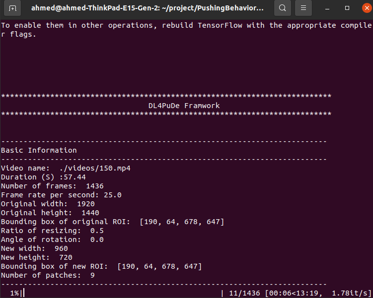

# Automatic Pushing Behavior Detection Framework
This repository is for the automatic pushing behavior detection framework. 
#### Content
1. Souce code of the framework.
2. Source code of building and training supervised CNN architictures.
3. Source code with patch-based test sets for evaluating the CNN-based classifiers. 
4. Generated CNN-based classifiers.
5. Experiments videos.
6. Demos.

#### Goal
The framework aims to automatically detect pushing behavior at the patch level in videos. It focuses on videos of crowded event entrances that captured by static top-view cameras.

We would like to draw your attention that our pushing behavior differs from the known aggressive pushing behavior (physical aggressive human behavior ). Our pushing behavior is defined as a  set of unfair strategies (e.g., increasing the speed with changing the direction)  for faster access toward the event.


#### The architecture of the framework

Kindly note, we use the [RAFT repo](https://github.com/princeton-vl/RAFT) for optical flow estimation in our project.

Demos
<table border="0" width="100%" align="center">
<tr>
   <th align="cenetr"> Input video </th>
   <th align="cenetr"> Output video * </th>
   
</tr>

<tr>
   <td align="center">  </td>
   <td align="center">  </td>
</tr>


<tr>
   <td colspan="2"> * The framework detects pushing patches every 12 frames (12/25 s). The red boxes refer to the pushing patches. </td>
</tr>
</table>

#### Installation
1. Please clone the repository in your directory.
```
git clone https://github.com/PedestrianDynamics/PushingBehaviorDetectionFramework.git
```
2. Please install the required libraries.
```
pip install -r libraries.txt
```
3. Run the framework. 
```
python3 run.py --video [input video path]  
               --roi ["x coordinate of left-top ROI corner" "y coordinate of left-top ROI corner"
               "x coordinate of  right-bottom ROI corner" "y coordinate of right-bottom ROI corner" ]               --patch [rows cols]    
               --ratio [scale of video]   
               --angle [angle in degrees for rotating the input video to make crowd flow direction
               from left to right ---> ]
```   
4. Demo 
<br/>

>Run the follwing command

```   
python3 run.py --video ./videos/150.mp4 --save --roi 380 128 1356 1294 --patch 3 3 --ratio 0.5  --angle 0
```  
>Now you  see the following details




> When the progress of the framework is complete, it will generate the annotated video in the framework directory. Please note that the 150 annotated video is available in the directory root under the "150-demo.mp4" name.


