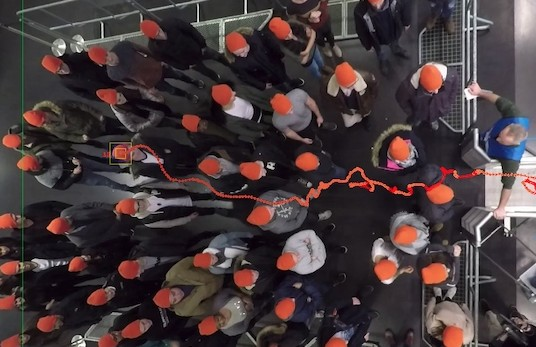

# Automatic Deep Learning Pushing Behavior Detection Framework

This repository is for the automatic pushing behavior detection framework. 
#### Content
1. Souce code of the framework.
2. How to install and use the framework?
3. Source code of building and training supervised CNN architictures.
4. Source code with patch-based test sets for evaluating the CNN-based classifiers. 
5. Generated CNN-based classifiers.
6. Experiments videos.

#### Goal
The framework aims to automatically detect pushing behavior at the patch level in videos. It focuses on videos of crowded event entrances that captured by static top-view cameras.
#### Pushing behavior defention
<table width="100%" align="center" border="0">
<tr>
    <td align="center">   </td>
    <td align="center">   </td>
    <td align="center">   </td>
</tr>
</table>


We would like to draw your attention that our pushing behavior differs from the known aggressive pushing behavior (physical aggressive human behavior ). Our pushing behavior is defined as a set of unfair strategies (e.g., increasing the speed with changing the direction) to get the event faster.


#### The architecture of the framework

Kindly note, we use the [RAFT repo]("https://github.com/princeton-vl/RAFT") for optical flow estimation in our project.

Demos
<table border="0" width="100%" align="center">
<tr>
   <th align="cenetr"> Input video </th>
   <th align="cenetr"> Output video * </th>
   
</tr>

<tr>
   <td align="center">  </td>
   <td align="center">  </td>
</tr>


<tr>
   <td colspan="2"> * The framework detects pushing patches every 12 frames (12/25 s). The red boxes refer to the pushing patches. </td>
</tr>
</table>

#### Installation
1. Please clone the repository in your directory.
```
git clone https://github.com/PedestrianDynamics/PushingBehaviorDetectionFramework.git
```
2. Please install the required libraries.
```
pip install -r libraries.txt
```
3. Run the framework. 
```
python3 run.py --video [input video path]  
               --roi ["x coordinate of left-top ROI corner" "y coordinate of left-top ROI corner"
               "x coordinate of  right-bottom ROI corner" "y coordinate of right-bottom ROI corner" ]               --patch [rows cols]    
               --ratio [scale of video]   
               --angle [angle in degrees for rotating the input video to make crowd flow direction
               from left to right ---> ]
```   
4. Demo 
<br/>

>Run the follwing command

```   
python3 run.py --video ./videos/150.mp4  --roi 380 128 1356 1294 --patch 3 3 --ratio 0.5  --angle 0
```  
> Then, you  see the following details.


> When the progress of the framework is complete, it will generate the annotated video in the framework directory. Please note that the 150 annotated video is available in the directory root under the "150-demo.mp4" name.

#### Experiments videos

The original experiments videos that are used in this work, are available through the [Pedestrian Dynamics Data Archive hosted](http://ped.fz-juelich.de/da/2018crowdqueue) by the Forschungszentrum Juelich. Also, the undistorted videos are available by [this link.](https://drive.google.com/drive/folders/16eZhC9mnUQUXxUeIUXd6xwBU2fSf3qCz?usp=sharing) 

#### CNN-based classifiers

The framework uses the learned EfficientNet-B0-based classifier from patch-based medium RAFT MIM12 dataset. In this work, Four well-known CNN architectures are learned from different optical flow pushing behavior datasets to generate several CNN-based classifiers. We then select the most classifier, which is the EfficientNet-B0-based classifier with patch-based medium RAFT MIM12 dataset.
The source code for building and training the CNN architectures, CNN-based classifiers and evaluation of the classifiers are available in the below links.
1. Source code for building and training the CNN architectures.
   * [EfficientNet-B0-based CNN.](./CNN/CNN-Architectures/efficientNetB0.ipynb)
   * [MobileNet-based CNN.](./CNN/CNN-Architectures/InceptionV3.ipynb)
   * [InceptionV3-B0-based CNN.](./CNN/CNN-Architectures/MobileNet.ipynb/InceptionV3.ipynb)
   * [ResNet50-B0-based CNN.](./CNN/CNN-Architectures/ResNet50.ipynb)
2. [CNN-based classifiers.](https://drive.google.com/drive/folders/1vmgYufnt4_NNQUE9PGYZLkrn5DmErENu?usp=sharing)
3. Evaluation of CNN-based classifiers.
   * [Patch-based medium RAFT MIM12 dataset.](./CNN/Classifiers-evaluation/patch-based-medium-RAFT-MIM12/)
   * [Patch-based medium RAFT MIM25 dataset.](./CNN/Classifiers-evaluation/patch-based-medium-RAFT-MIM25/)
   * [Patch-based small RAFT MIM12 dataset.](./CNN/Classifiers-evaluation/patch-based-small-RAFT-MIM12/)
   * [Patch-based small RAFT MIM25 dataset.](./CNN/Classifiers-evaluation/patch-based-small-RAFT-MIM25/)
   * [Patch-based medium FB MIM12 dataset.](./CNN/Classifiers-evaluation/patch-based-medium-FB-MM12/)
   * [Frame-based RAFT MIM12 training and validation sets, patch-based RAFT MIM12.](./CNN/Classifiers-evaluation/frame-based-RAFT-MIM12/)
   * [Frame-based RAFT MIM25 training and validation sets, patch-basedRAFT MIM25.](./CNN/Classifiers-evaluation/frame-based-RAFT-MIM25/)
   


  
